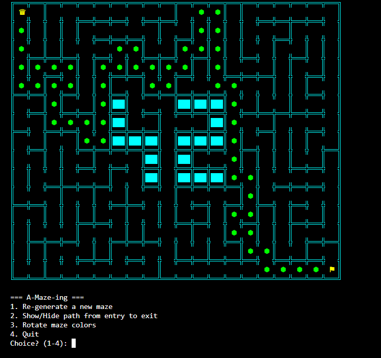
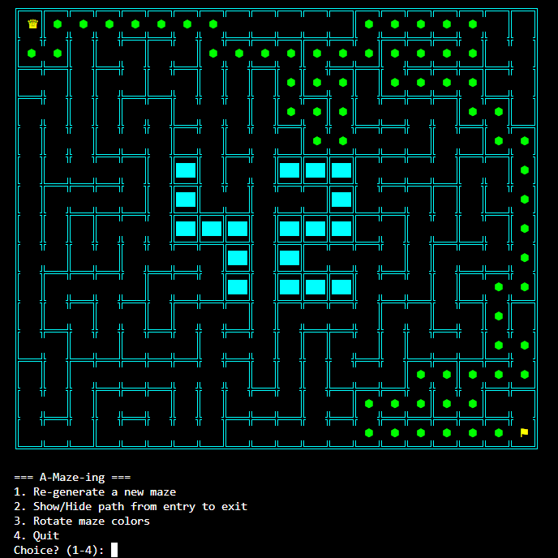
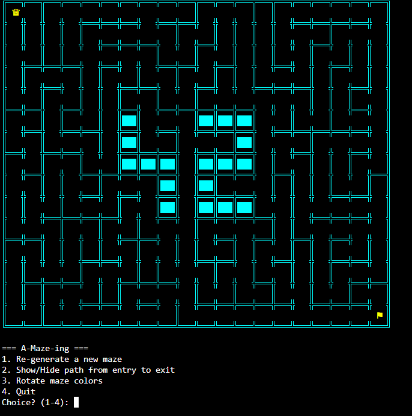

*This activity has been created as part of the 42 curriculum by habu-har, salalawn.*

# A-Maze-ing

## Description

**A-Maze-ing** is a terminal-based maze generator and solver written in Python. Given a simple
configuration file (size, entry/exit points, and a few flags), it:

- Procedurally generates a maze on a rectangular grid of cells, each with up to 4 walls
  (North, East, South, West).
- Embeds a fixed **"42"** pattern into the maze as a block of fully-closed, unreachable cells.
- Computes the shortest path between the entry and the exit using a breadth-first search.
- Renders the maze live in the terminal, with the entry (♛), the exit (⚑), the "42" pattern
  (solid blocks), and — on demand — the solution path (green hexagons).
- Lets the user regenerate a new random maze, toggle the solution path on/off, and rotate the
  wall colors, all from a simple menu.
- Exports the generated maze (walls + entry/exit + solution) to a plain-text hexadecimal file.

The goal of the project is to practice procedural generation, graph traversal, clean/reusable
class design, and terminal rendering, while respecting a strict, fully-testable specification.

## Instructions

### Requirements

- Python 3.10+ (uses `list[...]` built-in generics and modern type hints)
- No third-party dependencies for the core program (standard library only)

### Installation

```bash
git clone <this-repository-url>
cd a-maze-ing
make install
```

### Running the program

```bash
make run
```

This is equivalent to:

```bash
python3 a_maze_ing.py config.txt
```

You can point it at any config file:

```bash
python3 a_maze_ing.py path/to/your_config.txt
```

Once running, use the on-screen menu to:

1. Re-generate a new maze
2. Show/Hide the solution path
3. Rotate the maze wall colors
4. Quit

### Installation using a virtual environment (venv)

If you'd like to work inside a virtual environment (recommended, so you don't mix things up
with your system-wide Python packages), follow these steps in order:

```bash
# 1. Clone the project and move into its folder
git clone <this-repository-url>
cd a-maze-ing

# 2. Create the virtual environment
python3 -m venv venv

# 3. Activate the virtual environment
source venv/bin/activate

# 4. Upgrade pip inside the virtual environment
pip install --upgrade pip

# 5. Install the project and its dependencies (via pyproject.toml, not requirements.txt)
pip install -e .

# 6. (Optional) Check where you are and what's in the folder
ls

# 7. Run the style and type checks
make lint

# 8. Run the program
make run
```

**Important notes:**

- `cd a-maze-ing` must happen *before* creating or activating the virtual environment, not after.
- The project has no `requirements.txt` file; dependencies are declared in `pyproject.toml`
  (since the `mazegen` library is packaged as a pip package), so `pip install -e .` is the
  correct command instead of `pip install -r requirements.txt`.
- `pip install --upgrade pip` logically belongs *before* installing the project, not after.
- To deactivate the virtual environment later: `deactivate`.

### Linting / static checks

```bash
make lint
```

Runs `flake8` and `mypy` over the project.

### Cleaning generated files

```bash
make clean
```

Removes `__pycache__`, `.mypy_cache`, `.pytest_cache`, and other generated artifacts.

## Configuration File Format

The program reads a plain-text `KEY=VALUE` configuration file (see `config.txt` at the root of
this repository for a working default). Lines starting with `#` are comments and blank lines are
ignored.

| Key | Description | Example | Required |
|---|---|---|---|
| `WIDTH` | Maze width, in number of cells | `WIDTH=20` | Yes |
| `HEIGHT` | Maze height, in number of cells | `HEIGHT=15` | Yes |
| `ENTRY` | Entry cell coordinates `x,y` | `ENTRY=0,0` | Yes |
| `EXIT` | Exit cell coordinates `x,y` | `EXIT=19,14` | Yes |
| `OUTPUT_FILE` | Path of the exported maze file | `OUTPUT_FILE=maze.txt` | Yes |
| `PERFECT` | Whether the maze must have exactly one path between entry and exit | `PERFECT=True` | Yes |
| `SEED` | Optional RNG seed, for reproducible mazes | `SEED=555` | No (defaults to random) |

Validation performed on load:

- All 6 mandatory keys above must be present, or the program raises a clear error.
- `WIDTH` and `HEIGHT` must be strictly positive integers.
- `ENTRY` and `EXIT` must be different, valid `x,y` coordinates strictly inside the maze bounds.
- `OUTPUT_FILE` must not be empty.

### Output file format

The maze is exported as one hexadecimal digit per cell (row by row), where each bit of the digit
encodes a closed wall: `1`=North, `2`=East, `4`=South, `8`=West (added together). After the grid,
a blank line separates it from the entry coordinates, the exit coordinates, and finally the
solution path as a string of direction letters (e.g. `SSSEEN...`).

## Screenshots

The solution path (green) now stays short and thin, leaving the "42" pattern clearly readable
in every generated maze — this was the main bug fixed during development (see
[Maze Generation Algorithm](#maze-generation-algorithm) below).

**Solution path shown** — entry (♛) top-left, exit (⚑) bottom-right, "42" pattern intact:



**Solution path hidden** — same maze, toggled off via menu option 2:



**Wall colors rotated** — via menu option 3:



## Maze Generation Algorithm

We use **Randomized Prim's Algorithm**:

1. Start from the entry cell, mark it as part of the maze.
2. Maintain a "frontier" list of all unvisited cells adjacent to the maze.
3. Repeatedly pick a random cell from the frontier, connect it to one random already-visited
   neighbor (knocking down the wall between them), mark it visited, and add its own unvisited
   neighbors to the frontier.
4. Stop when the frontier is empty — every reachable cell is now part of a single spanning tree.
5. If `PERFECT=False`, an extra ~5% of interior walls are removed afterwards to introduce loops
   (multiple possible paths), while carefully avoiding the "42" pattern cells.

### Why this algorithm

We initially implemented a **Recursive Backtracker** (randomized depth-first search with a
stack), which is simpler to reason about but has a well-known side effect: it tends to produce
very long, winding corridors with few branches. On our grid, this meant the *unique* path between
entry and exit (since `PERFECT=True` guarantees only one path exists) would sometimes snake
through more than half of the maze — visually "flooding" the screen with the solution path and
overwhelming the "42" pattern instead of leaving it clearly visible.

We measured this directly: over repeated random generations, the Recursive Backtracker produced
solution paths ranging from ~66 to ~168 cells (out of ~280 usable cells). Switching to Randomized
Prim's Algorithm — which grows the maze from many directions at once instead of a single advancing
line — consistently produced much shorter, more balanced solution paths (~34 to ~46 cells) while
still satisfying every correctness requirement of the specification (full connectivity, coherent
walls, sealed borders, no open area wider than 2 cells, and exactly one path when `PERFECT=True`).

One subtlety we had to handle: the "42" pattern cells are marked as already "visited" before
generation starts (so the algorithm never carves into them), but they must never be treated as a
legitimate connection point either. We solve this without any extra class attribute or method: a
"42" cell is recognized at runtime because it permanently keeps all 4 walls closed
(`get_hex() == 'F'`), the only exception being the entry cell itself, which also starts fully
closed before its very first wall is opened.

## Reusable Code

The `MazeGenerator` class (in `maze_generator.py`) is fully decoupled from the rendering and
solving logic, and can be reused as a standalone maze-generation library in any other project.

### Basic usage

```python
from config_loader import Config
from maze_generator import MazeGenerator

config = Config("config.txt")          # load and validate a config file
generator = MazeGenerator(config)      # build the (empty) grid
generator.generate_maze()              # carve the maze in place
```

### Custom parameters

Parameters (size, entry/exit, perfect flag, seed) are not passed directly to `MazeGenerator`;
they come from a `Config` object, which can be built from any config file:

```python
config = Config("my_custom_config.txt")   # WIDTH, HEIGHT, ENTRY, EXIT, PERFECT, SEED, ...
generator = MazeGenerator(config)
generator.generate_maze()
```

### Accessing the generated structure and a solution

```python
# The grid is a list of rows of Cell objects, each with .north/.east/.south/.west booleans
int_grid = [[int(cell.get_hex(), 16) for cell in row] for row in generator.grid]

from maze_solver import MazeSolver

solver = MazeSolver(int_grid, generator.entry, generator.exit)
solver.solve()
path_coords = solver.get_path_coord()   # list of (x, y) tuples from entry to exit
path_string = solver.get_path_string()  # e.g. "SSSEEN..."
```

This whole reusable module (code + this documentation) is also packaged as an installable pip
package at the root of this repository: `mazegen-1.0.0-py3-none-any.whl` /
`mazegen-1.0.0.tar.gz`.

## Resources

- [Wikipedia — Maze generation algorithm](https://en.wikipedia.org/wiki/Maze_generation_algorithm)
- [Jamis Buck — "Buckblog": Maze Generation series](https://weblog.jamisbuck.org/2011/2/7/maze-generation-algorithm-recap)
- Python official documentation: [`random`](https://docs.python.org/3/library/random.html),
  [`collections.deque`](https://docs.python.org/3/library/collections.html#collections.deque)
  (used for BFS in the solver)
- [PEP 257 — Docstring Conventions](https://peps.python.org/pep-0257/)

### How AI was used

We used Claude (Anthropic) as a support assistant throughout this project, specifically for:

- **Understanding the project as a whole**: helping us get a clear picture of the subject's
  requirements before starting, and how the different pieces (generation, solving, rendering,
  configuration) fit together.
- **Splitting roles between us**: helping us divide the work into a sensible split (generation/
  solving vs. rendering/configuration/CLI) based on the scope of each part.
- **Fixing a handful of `flake8` and `mypy --strict` issues**: a small number of linting and
  strict type-checking errors that came up during the project-wide code-quality pass.

All AI-suggested changes were reviewed, tested, and understood by us before being committed.
The core program logic, structure, and implementation are our own work.

## Team and Project Management

### Roles

Work was split by module, with a lot of cross-review and mutual debugging rather than
strictly separate silos — whoever finished their part first would jump in and help review
or fix the other's code, so the split below reflects primary ownership, not the only
person who ever touched that file.

- **habu-har**: packaging the reusable module as an installable pip package (`mazegen-*`,
  `pyproject.toml`), the `Makefile` (install/run/debug/clean/lint targets), the BFS
  `maze_solver.py`, the `.gitignore`, and the project-wide code-quality pass — adding
  type hints (`typing` module) and getting the whole project to pass `mypy` cleanly,
  writing the PEP 257 docstrings for every class, and auditing resource handling
  (e.g. making sure file operations use `with` context managers instead of manual
  open/close) to avoid leaks.
- **salalawn**: the terminal rendering (`TerminalRenderer.py`), the configuration loader
  (`config_loader.py`) and `config.txt`, and the interactive menu / terminal-size
  handling in `a_maze_ing.py` (checking the window is large enough before drawing the
  maze, and prompting the user to enlarge it otherwise).

The maze generation itself (`maze_generator.py`) — including the "42" pattern and the
switch from a Recursive Backtracker to Randomized Prim's Algorithm to fix the
long-solution-path bug — was debugged and rewritten together.

### Planning

Our initial plan was to split the project cleanly down the middle: one of us owns
generation/solving, the other owns rendering/configuration/CLI, then merge and polish
(README, packaging, linting) together at the end. In practice, the "polish" phase ended
up being much bigger than expected: testing the maze generator against the actual subject
requirements surfaced several issues we hadn't planned for — the solution path sometimes
covering most of the maze, a connectivity bug introduced while fixing that, a missing
mandatory config key (`PERFECT`) not being validated, and gaps in docstring coverage. So
the timeline shifted: less time than expected on the initial generate/render split (which
went smoothly), and more time than expected on debugging, validation, packaging, and
documentation near the end.

### What worked well / what could be improved

What worked well: helping each other out rather than staying strictly in our own lane —
whenever one of us got stuck (or noticed something off in the other's part while testing),
we'd jump in and debug it together instead of waiting. This caught several bugs early
(like the terminal-size handling and the config validation gap) that a stricter split
might have missed until much later.

What could be improved: we left packaging (pip module) and full documentation (README,
docstrings, `.gitignore`) until near the end, which made that final stretch more rushed
than it needed to be. Next time we'd start the Makefile/lint/docstring setup from day one
instead of retrofitting it once the core logic already worked.

### Tools used

- **Git / GitHub** for version control and collaboration.
- **Claude (Anthropic)** as a project-understanding and code-quality assistant (see
  [How AI was used](#how-ai-was-used) above).
- **flake8** and **mypy** for linting and static type checking.
- **pip / build** for packaging the reusable `mazegen` module.
- **make** for standardizing install/run/debug/clean/lint commands.
